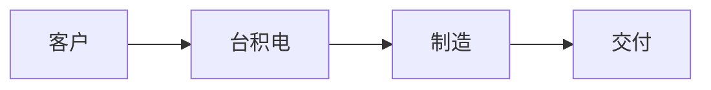
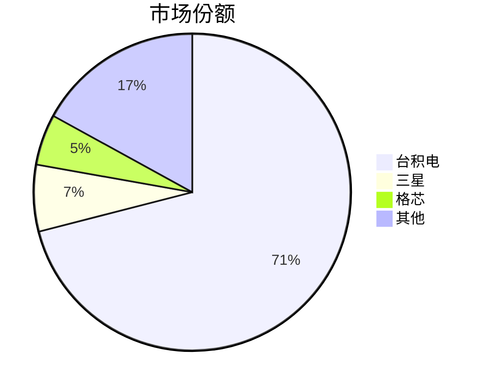

# SlideDev Syntax Reference

Complete syntax reference for SlideDev (Slidev.js). Use this when generating SlideDev presentations.

## Project Setup

```bash
npm init slidev@latest
# Or manually:
mkdir project && cd project
npm init -y
npm install @slidev/cli @slidev/theme-default
```

## Global Headmatter

The first block in `slides.md` before any `---` separator:

```yaml
---
theme: seriph
title: "演示文稿标题"
info: |
  ## 演示文稿副标题
  详细描述信息
transition: slide-left
fonts:
  sans: "Noto Sans SC"
  serif: "Noto Serif SC"
  mono: "Fira Code"
  weights: "400,700"
highlighter: shiki
lineNumbers: false
drawings:
  persist: false
mdc: true
---
```

### Key Global Options

| Option | Values | Description |
|--------|--------|-------------|
| `theme` | `default`, `seriph`, `apple-basic`, `bricks` | Visual theme |
| `transition` | `fade`, `slide-left`, `slide-up`, `none` | Default transition |
| `fonts.sans` | Font family name | Primary sans-serif font |
| `fonts.weights` | `"400,700"` | Font weights to load |
| `highlighter` | `shiki`, `prism` | Code highlighting engine |
| `lineNumbers` | `true`, `false` | Show line numbers in code |

## Slide Separators

```markdown
---    # Normal slide separator

---    # With per-slide frontmatter
layout: center
transition: fade
---
```

## Per-Slide Frontmatter

```yaml
---
layout: cover
background: "https://example.com/bg.jpg"
class: text-center
transition: fade
clicks: 3
---
```

| Option | Description |
|--------|-------------|
| `layout` | Slide layout (see Built-in Layouts below) |
| `background` | Background image URL |
| `class` | CSS classes applied to slide |
| `transition` | Override transition for this slide |
| `clicks` | Total number of click steps |

## Built-in Layouts

### `cover` — Title/opening slide

```markdown
---
layout: cover
background: "linear-gradient(135deg, #1a1a2e 0%, #16213e 100%)"
---

# 演示文稿标题

副标题或作者信息

<div class="abs-bl m-6 text-sm opacity-50">
日期 · 作者
</div>
```

### `section` — Section divider

```markdown
---
layout: section
---

# 第一章
## 章节副标题
```

### `center` — Centered content

```markdown
---
layout: center
---

# 一句核心观点

居中显示的重点内容
```

### `statement` — Bold statement

```markdown
---
layout: statement
---

# 不竞争是最强的竞争策略
```

### `fact` — Key statistic

```markdown
---
layout: fact
---

# 71%
全球晶圆代工市场份额
```

### `quote` — Quotation

```markdown
---
layout: quote
---

# "产能卖光了，一直到2026年都是满的"

— 魏哲家，台积电CEO
```

### `two-cols` — Two columns

```markdown
---
layout: two-cols
---

# 左侧标题

左侧内容在这里

::right::

# 右侧标题

右侧内容在这里
```

### `two-cols-header` — Two columns with shared header

```markdown
---
layout: two-cols-header
---

# 对比标题

::left::

### 台积电
- 市占率 71%
- 毛利率 60%

::right::

### 三星
- 市占率 6.8%
- 亏损 24亿美元
```

### `image-right` — Content with image on right

```markdown
---
layout: image-right
image: "path/to/image.png"
---

# 标题

正文内容在左侧
```

### `full` — Full-bleed content

```markdown
---
layout: full
---

全屏内容
```

### `default` — Standard content slide

```markdown
---
layout: default
---

# 标题

- 要点一
- 要点二
- 要点三
```

## Slot Syntax

Layouts with multiple content areas use slot syntax:

```markdown
::left::
左侧内容

::right::
右侧内容

::default::
默认区域内容
```

## Animations & Progressive Reveal

### `v-click` — Single element reveal

```markdown
<div v-click>这个在第一次点击后显示</div>
<div v-click>这个在第二次点击后显示</div>
```

### `v-clicks` — Reveal children one by one

```markdown
<v-clicks>

- 第一点
- 第二点
- 第三点

</v-clicks>
```

### `v-click` with ranges

```markdown
<div v-click="[1, 3]">在第1次点击显示，第3次点击隐藏</div>
```

### `v-click.hide` — Hide on click

```markdown
<div v-click.hide>初始可见，点击后隐藏</div>
```

### `v-after` — Show with previous click

```markdown
<div v-click>第一次点击显示</div>
<div v-after>同时显示（跟随上一个 v-click）</div>
```

### `v-motion` — Motion animation

```markdown
<div
  v-motion
  :initial="{ x: -80, opacity: 0 }"
  :enter="{ x: 0, opacity: 1, transition: { delay: 200 } }"
>
  从左侧滑入的内容
</div>
```

## Transitions

Set globally in headmatter or per-slide in frontmatter:

```yaml
transition: slide-left    # Default: slide from right
transition: fade           # Crossfade
transition: slide-up       # Slide from bottom
transition: slide-right    # Slide from left
transition: slide-down     # Slide from top
transition: none           # No transition
```

### Per-slide transition override

```yaml
---
transition: fade
---
```

## Code Blocks

### Basic code with syntax highlighting

````markdown
```python
def hello():
    print("Hello, World!")
```
````

### Line highlighting

````markdown
```python {2,3}
def hello():
    print("Hello")     # highlighted
    print("World")     # highlighted
```
````

### Click-based line highlighting

````markdown
```python {1|2-3|4}
def process():
    step_one()
    step_two()
    step_three()
```
````

## Mermaid Diagrams

````markdown

````

````markdown

````

## Scoped CSS

Add per-slide styling at the bottom of a slide:

```markdown
# 标题

内容

<style>
h1 {
  font-size: 3em;
  background: linear-gradient(135deg, #667eea 0%, #764ba2 100%);
  -webkit-background-clip: text;
  -webkit-text-fill-color: transparent;
}
</style>
```

## UnoCSS Utility Classes

SlideDev includes UnoCSS. Common utilities:

```markdown
<div class="text-3xl font-bold text-blue-500">大号蓝色粗体文字</div>
<div class="flex gap-4 items-center">弹性布局</div>
<div class="grid grid-cols-2 gap-8">网格布局</div>
<div class="opacity-50">半透明</div>
<div class="mt-8 mb-4">外边距</div>
<div class="abs-br m-6">绝对定位右下角</div>
<div class="abs-bl m-6">绝对定位左下角</div>
```

## Speaker Notes

Add notes as HTML comments at the end of each slide:

```markdown
# 标题

内容

<!--
这里是演讲者备注。
只在演讲者视图中可见。
按 S 键打开演讲者视图。
-->
```

## Chinese Font Configuration

In the global headmatter:

```yaml
---
fonts:
  sans: "Noto Sans SC"
  serif: "Noto Serif SC"
  mono: "Fira Code"
  weights: "400,700"
  provider: google
---
```

SlideDev will automatically load fonts from Google Fonts when `provider: google` is set.

### Additional CSS for Chinese typography

```markdown
<style>
:root {
  --slidev-font-family: "Noto Sans SC", "PingFang SC", "Microsoft YaHei", sans-serif;
}
.slidev-layout {
  line-height: 1.8;
  letter-spacing: 0.05em;
}
.slidev-layout h1 {
  letter-spacing: 0.08em;
}
</style>
```

## Complete Single-Slide Example

```markdown
---
layout: two-cols-header
transition: slide-left
---

# 台积电 vs 竞争对手

::left::

### 台积电 🏭

<v-clicks>

- 市占率：**71%**
- 毛利率：**~60%**
- 3nm 良率：**>90%**
- 资本支出：**409亿美元**

</v-clicks>

::right::

### 三星 + 英特尔

<v-clicks>

- 三星市占率：**6.8%** ↓
- 三星代工：亏损
- 英特尔代工：亏损 **103亿**
- 三星3nm良率：**~20%**

</v-clicks>

<!--
关键对比：台积电不仅在市占率上碾压，利润率也远超对手。
三星和英特尔的代工业务都在亏损，无法支撑大规模研发投入。
-->
```
