# ai-ppt

一个 Claude Code Skill，将文章、文档、PPT 自动转换为专业演示文稿。

## 功能

- **文章转幻灯片** — 输入 Markdown、纯文本或 URL，自动分析内容结构并生成演示文稿
- **PPT 转网页** — 将 .pptx 文件转换为可在浏览器中展示的网页演示文稿
- **三种输出框架**：
  - **SlideDev** — Markdown 驱动，适合技术演讲、含代码和图表的场景
  - **Reveal.js** — 单 HTML 文件 + CDN，通用演示场景
  - **纯 HTML** — 零依赖，完全自包含，直接浏览器打开
- **12 套视觉风格预设** — 涵盖暗色/亮色/特殊主题，每套包含完整的配色、字体和动画方案
- **15 种幻灯片类型** — Cover、Statement、Timeline、Comparison、Diagram 等
- **中文排版优化** — 专门的 CJK 字体加载、间距和标点规则

## 使用方式

在 Claude Code 中对话即可触发，例如：

```
把这篇文章做成PPT
生成演示文稿
make a presentation from this article
```

## 执行流程

```mermaid
flowchart TD
    Start([用户触发 ai-ppt]) --> P0S1[Phase 0.1: 检测输入类型]

    P0S1 --> P0S2

    P0S2{{"💬 Phase 0.2: 框架选择<br/>Reveal.js / SlideDev / 纯HTML / 帮我选"}}

    P0S2 --> P1[Phase 1: 深度内容分析]

    P1 --> P1S1["Step 1: 解析结构<br/>标题层级 → 章节边界<br/>估算 slide 数量"]
    P1S1 --> P1S2["Step 2: 标注内容单元<br/>thesis / data_point / comparison<br/>quote / narrative / concept..."]
    P1S2 --> P1S3["Step 3: 图片审计<br/>扫描所有图片 → 分类<br/>Keep / Adapt / Drop"]
    P1S3 --> P1S4["Step 4: 提取关键要素<br/>数据点 / 金句 / 核心论点"]
    P1S4 --> P1S5[Step 5: 构建内容清单]

    P1S5 --> ImgCheck{源内容有图片吗?}

    ImgCheck -->|有图片| P2
    ImgCheck -->|无图片| P15{{"💬 Phase 1.5: 图片建议<br/>提供图片 / 不需要 / 部分采纳"}}
    P15 -->|用户提供图片| P1S3b[重新审计用户提供的图片]
    P1S3b --> P2
    P15 -->|不需要图片| P2

    P2["🔧 ai-ppt-style<br/>Phase 2: 风格发现"]
    P2 --> P2S1["分析文章情绪<br/>Impress / Excite / Calm / Inspire"]
    P2S1 --> P2S1a{{"💬 Phase 2.1: 风格选择<br/>3个预设 + 自定义参考风格"}}

    P2S1a -->|选择预设| P2S2
    P2S1a -->|自定义参考风格| P2Custom{{"💬 收集参考素材<br/>截图 / HTML·CSS / 文字描述"}}
    P2Custom --> P2Extract["提取视觉 DNA<br/>配色 / 字体 / 布局 / 动画"]
    P2Extract --> P2CustomConfirm{{"💬 确认提取的风格<br/>满意吗？需要调整？"}}
    P2CustomConfirm --> P2S2

    P2S2[确定动画情绪]
    P2S2 --> P2S3["设计 Slide 序列<br/>应用节奏规则"]
    P2S3 --> P2S5{{"💬 Phase 2.5: 确认 Slide Plan<br/>这个结构可以吗？"}}

    P2S5 --> P3{根据框架选择}

    P3 -->|SlideDev| SlideDev["🔧 ai-ppt-slidev<br/>生成 slides.md + package.json"]
    P3 -->|Reveal.js| Revealjs["🔧 ai-ppt-revealjs<br/>生成 index.html（CDN）"]
    P3 -->|纯 HTML| Html["🔧 ai-ppt-html<br/>生成零依赖 HTML"]

    SlideDev --> P4
    Revealjs --> P4
    Html --> P4

    P4["Phase 4: 质量检查<br/>内容 / 节奏 / 视觉 / 图片 / 框架"]
    P4 --> Deliver[交付 + 运行说明]
    Deliver --> Iterate{{"💬 需要调整吗？<br/>增减幻灯片 / 换风格 / 调动画"}}

    style P0S2 fill:#FFE4B5,stroke:#FF8C00,color:#000
    style P15 fill:#FFE4B5,stroke:#FF8C00,color:#000
    style P2S1a fill:#FFE4B5,stroke:#FF8C00,color:#000
    style P2Custom fill:#FFE4B5,stroke:#FF8C00,color:#000
    style P2CustomConfirm fill:#FFE4B5,stroke:#FF8C00,color:#000
    style P2S5 fill:#FFE4B5,stroke:#FF8C00,color:#000
    style Iterate fill:#FFE4B5,stroke:#FF8C00,color:#000

    style P2 fill:#E0F0FF,stroke:#4361EE,color:#000
    style SlideDev fill:#E0F0FF,stroke:#4361EE,color:#000
    style Revealjs fill:#E0F0FF,stroke:#4361EE,color:#000
    style Html fill:#E0F0FF,stroke:#4361EE,color:#000
```



> 🟧 橙色节点 = 与用户交互确认点 &nbsp; 🔵 蓝色节点 = 子 skill 调用

### 用户交互点一览

| # | 阶段 | 问什么 | 是否必须 |
|---|------|--------|---------|
| 1 | Phase 0.2 | 选框架（Reveal.js / SlideDev / HTML / 帮我选） | 必须 |
| 2 | Phase 1.5 | 文章无图片时，要不要补充图片 | 条件触发 |
| 3 | Phase 2.1 | 选视觉风格（3 预设 + 自定义参考） | 必须 |
| 4 | Phase 2.1b | 自定义时：提供参考素材方式 | 条件触发 |
| 5 | Phase 2.1b | 自定义时：确认提取的风格 | 条件触发 |
| 6 | Phase 2.5 | 确认 slide plan 表格 | 必须 |
| 7 | 交付后 | 需要调整吗？ | 可选 |

## 示例项目

`projects/tsmc/` 包含一个完整示例 — 将台积电商业分析文章转换为演示文稿：

```bash
# 运行 SlideDev 版本
npm run dev:tsmc

# 构建 SlideDev 版本
npm run build:tsmc

# Reveal.js 版本直接浏览器打开
open projects/tsmc/index.html
```

## 项目结构

```
.claude/skills/
├── ai-ppt/                        # 主编排 skill
│   ├── SKILL.md                   # 输入检测 → 内容分析 → 编排子skill → 质量检查
│   └── references/
│       ├── slide-type-catalog.md  # 15 种幻灯片类型
│       └── chinese-typography.md  # 中文排版规则
├── ai-ppt-style/                  # 风格发现 + 参考风格提取
│   ├── SKILL.md
│   └── references/
│       ├── style-presets.md       # 12 套视觉风格预设
│       ├── animation-patterns.md  # 6 种动画情绪模式
│       └── custom-style-guide.md  # 从截图/HTML/CSS 提取自定义风格
├── ai-ppt-slidev/                 # SlideDev 生成器
│   ├── SKILL.md
│   └── references/
│       └── slidev-syntax.md
├── ai-ppt-revealjs/               # Reveal.js 生成器
│   ├── SKILL.md
│   └── references/
│       └── revealjs-syntax.md
├── ai-ppt-html/                   # 零依赖 HTML 生成器
│   ├── SKILL.md
│   └── references/
│       ├── html-template.md
│       └── viewport-base.css
└── ai-ppt-extract/                # PPT 内容提取
    ├── SKILL.md
    └── references/
        └── extract-pptx.py
projects/                          # 生成的演示文稿项目
```

## 依赖

```bash
npm install
```

PPT 提取功能需要 Python 和 `python-pptx`：

```bash
pip install python-pptx
```
