# ai-ppt

一个 Claude Code Skill，将文章、文档、PPT 自动转换为专业演示文稿。

## 亮点功能

### 🎨 12 套精选视觉风格 + 实时浏览器预览

不是抽象地问"深色还是浅色"，而是根据文章情绪自动推荐 3 个匹配风格，**在浏览器中打开预览 HTML**，让你切换标签页直观对比后再选择。

| 情绪 | 推荐预设 |
|------|---------|
| 想给人留下深刻印象 | Bold Signal · Electric Studio · Dark Botanical |
| 想让人兴奋/激动 | Creative Voltage · Neon Cyber · Split Pastel |
| 想让人感到平静/信任 | Pastel Geometry · Swiss Modern · Paper & Ink |
| 想激发思考/灵感 | Vintage Editorial · Notebook Tabs · Terminal Green |

### 🖌️ 自定义参考风格提取

提供截图、HTML/CSS 代码或文字描述，自动提取视觉 DNA（配色 / 字体 / 布局 / 动画），生成预览 HTML 后与 3 个相近预设一起在浏览器中打开，方便对比微调。

### 📐 15 种幻灯片类型

Cover · Single Stat · Thesis · Bullet Points · Two-Column · Timeline · Quote · Comparison · Diagram · Image Showcase · Code Block · Section Divider · Summary · CTA · Closing — 根据内容自动选型，保证演示节奏。

### 🎬 6 种动画情绪模式

Professional（快速精准）· Dramatic（慢速宏大）· Techy（发光网格）· Playful（弹性回弹）· Editorial（错落文字）· Calm（柔和渐现）— 自动匹配风格预设。

### 🔧 Reveal.js 单文件输出

生成单个 HTML 文件 + CDN 依赖，直接浏览器打开，适用于所有演示场景。

### 🀄 中文排版优化

专门的 CJK 字体加载策略、中英文混排间距、标点挤压规则，告别 AI 生成的"洋味排版"。

## 使用方式

在 Claude Code 中对话即可触发：

```
把这篇文章做成PPT
生成演示文稿
make a presentation from this article
```

## 执行流程

```mermaid
flowchart TD
    Start([用户触发 ai-ppt]) --> P0S1[Phase 0: 检测输入类型<br/>自动使用 Reveal.js]

    P0S1 --> P1[Phase 1: 深度内容分析]

    P1 --> P1S1["Step 1: 解析结构<br/>标题层级 → 章节边界<br/>估算 slide 数量"]
    P1S1 --> P1S2["Step 2: 标注内容单元<br/>thesis / data_point / comparison<br/>quote / narrative / concept..."]
    P1S2 --> P1S3["🔧 ai-ppt-image<br/>Step 3: 图片审计 + 充足性分析<br/>Keep / Adapt / Drop → 覆盖率评估"]
    P1S3 -->|充足| P1S4
    P1S3 -->|不足 / 无图片| P15{{"💬 图片建议<br/>表格展示缺口 + 优先级<br/>补充图片 / 用已有 / 部分采纳"}}
    P15 -->|用户提供图片| P1S3b[审计用户提供的图片<br/>与已有图片合并]
    P1S3b --> P1S4
    P15 -->|不补充图片| P1S4
    P1S4["Step 4: 提取关键要素<br/>数据点 / 金句 / 核心论点"]
    P1S4 --> P1S5[Step 5: 构建内容清单]

    P1S5 --> P2

    P2["🔧 ai-ppt-style<br/>Phase 2: 风格发现"]
    P2 --> P2S1["分析文章情绪<br/>Impress / Excite / Calm / Inspire"]
    P2S1 --> P2Preview["🌐 自动打开浏览器<br/>打开 3 个预设风格预览 HTML"]
    P2Preview --> P2S1a{{"💬 Phase 2.1: 风格选择<br/>3个预设 + 自定义参考风格<br/>（预览已在浏览器中打开）"}}

    P2S1a -->|选择预设 A/B/C| P2S2
    P2S1a -->|自定义参考风格| P2Custom{{"💬 收集参考素材<br/>截图 / HTML·CSS / 文字描述"}}
    P2Custom --> P2Extract["提取视觉 DNA<br/>配色 / 字体 / 布局 / 动画"]
    P2Extract --> P2GenPreview["生成自定义风格预览<br/>style-preview.html"]
    P2GenPreview --> P2PreviewCustom["🌐 自动打开浏览器<br/>自定义预览 + 3 个相近预设预览"]
    P2PreviewCustom --> P2PickCustom{{"💬 选择最终风格<br/>自定义 / 预设A / 预设B / 预设C"}}

    P2PickCustom --> P2S2

    P2S2[确定动画情绪]
    P2S2 --> P2S3["设计 Slide 序列<br/>应用节奏规则"]
    P2S3 --> P2S5{{"💬 Phase 2.5: 确认 Slide Plan<br/>这个结构可以吗？"}}

    P2S5 --> Revealjs["🔧 ai-ppt-revealjs<br/>Phase 3: 生成 Reveal.js HTML"]

    Revealjs --> P4

    P4["Phase 4: 质量检查<br/>内容 / 节奏 / 视觉 / 图片 / 框架"]
    P4 --> Deliver[交付 + 运行说明]
    Deliver --> Iterate{{"💬 需要调整吗？<br/>增减幻灯片 / 换风格 / 调动画"}}

    style P15 fill:#FFE4B5,stroke:#FF8C00,color:#000
    style P2S1a fill:#FFE4B5,stroke:#FF8C00,color:#000
    style P2Custom fill:#FFE4B5,stroke:#FF8C00,color:#000
    style P2PickCustom fill:#FFE4B5,stroke:#FF8C00,color:#000
    style P2S5 fill:#FFE4B5,stroke:#FF8C00,color:#000
    style Iterate fill:#FFE4B5,stroke:#FF8C00,color:#000

    style P1S3 fill:#E0F0FF,stroke:#4361EE,color:#000
    style P2 fill:#E0F0FF,stroke:#4361EE,color:#000
    style Revealjs fill:#E0F0FF,stroke:#4361EE,color:#000

    style P2Preview fill:#D4EDDA,stroke:#28A745,color:#000
    style P2PreviewCustom fill:#D4EDDA,stroke:#28A745,color:#000
    style P2GenPreview fill:#D4EDDA,stroke:#28A745,color:#000
```



> 🟧 橙色节点 = 用户交互点 &nbsp; 🔵 蓝色节点 = 子 skill 调用 &nbsp; 🟩 绿色节点 = 浏览器预览

### 用户交互点一览

| # | 阶段 | 问什么 | 是否必须 |
|---|------|--------|---------|
| 1 | Phase 1.5 | 图片不足时，展示缺口表格，要不要补充图片 | 条件触发 |
| 2 | Phase 2.1 | 🌐 **打开预览** + 选视觉风格（3 预设 + 自定义参考），一次完成 | 必须 |
| 3 | Phase 2.1b | 自定义时：提供参考素材方式 | 条件触发 |
| 4 | Phase 2.1c | 自定义时：🌐 打开自定义预览 + 3 个对比预设，选择最终风格 | 条件触发 |
| 5 | Phase 2.5 | 确认 slide plan 表格 | 必须 |
| 6 | 交付后 | 需要调整吗？ | 可选 |

### 风格预览机制

Phase 2.1 会先自动在浏览器中打开 3 个推荐预设风格预览 HTML（每个含 5 页示例幻灯片：封面、数据、列表、引言、对比），然后再让用户选择。用户只需选一次，无需二次确认。

如果用户选择自定义参考风格，Phase 2.1c 会额外打开自定义风格预览 + 3 个相近预设预览（共 4 个标签页），用户对比后选择最终风格。

## 示例项目

`projects/tsmc/` 包含一个完整示例 — 将台积电商业分析文章转换为演示文稿：

```bash
# Reveal.js 版本直接浏览器打开
open projects/tsmc/run_example_1_index.html
```

## 项目结构

```
.claude/skills/
├── ai-ppt/                        # 主编排 skill
│   ├── SKILL.md                   # 输入检测 → 内容分析 → 编排子skill → 质量检查
│   └── references/
│       ├── slide-type-catalog.md  # 15 种幻灯片类型
│       └── chinese-typography.md  # 中文排版规则
├── ai-ppt-style/                  # 风格发现 + 参考风格提取
│   ├── SKILL.md
│   └── references/
│       ├── style-presets.md       # 12 套视觉风格预设
│       ├── previews/              # 12 个预设风格预览 HTML
│       ├── animation-patterns.md  # 6 种动画情绪模式
│       └── custom-style-guide.md  # 从截图/HTML/CSS 提取自定义风格
├── ai-ppt-revealjs/               # Reveal.js 生成器
│   ├── SKILL.md
│   └── references/
│       └── revealjs-syntax.md
├── ai-ppt-image/                  # 图片审计 + 充足性分析
│   └── SKILL.md
└── ai-ppt-extract/                # PPT 内容提取
    ├── SKILL.md
    └── references/
        └── extract-pptx.py
projects/                          # 生成的演示文稿项目
```

## 依赖

```bash
npm install
```

PPT 提取功能需要 Python 和 `python-pptx`：

```bash
pip install python-pptx
```
